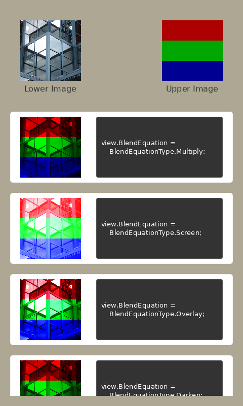

# Advanced Blend Equation property in View
This example shows how to use Advanced Blend Equation property in View.

## Preview
</th>

## Advanced Blend Equation

The `View.BlendEquation` property is used to be set Advanced Blend Equation.
This `BlendEquation` define how to mix the color of each pixel with its' beyond pixel color that is already drawn.

Here's a simple example with 2 `ImageView`s
In this example, each pixel of upperImageView is mixed with pixel of lowerImageView.

```C#
ImageView lowerImageView = new ImageView()
{
  ResourceUrl = resourceUrl1,
}
NUIApplication.GetDefaultWindow().Add(lowerImageView);

ImageView upperImageView = new ImageView()
{
  ResourceUrl = resourceUrl2,
  BlendEquation = BlendEquationType.Screen,
}
NUIApplication.GetDefaultWindow().Add(upperImageView);
```

NUI supports 20 Blend Equations including 15 Advanced Blend Equation.
And, this example shows results of Advanced Blend Equation.