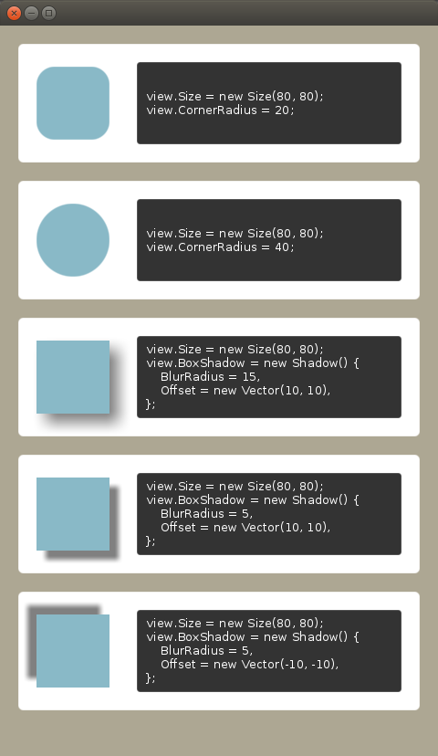

# CornerRadius and BoxShadow property in View
This example shows how to use CornerRadius and BoxShadow property in View.

## Preview
</th>

## CornerRadius

The `CornerRadius` is a float type property that make a `View` has rounded corners.
If the value is larger than a half length of one side of the square, it will look like a circle.

Here's a simple example.
```C#
var view = new View()
{
  Size = new Size(100, 100),
  BackgroundColor = Color.Blue,
  CornerRadius = 20,
};
```

## BoxShadow

The `BoxShadow` is a `Shadow` type property. And the `Shadow` has 4 properties : `BlurRadius`, `Offset`, `Color` and `Extents`.

The `BlurRadius` indicates the degree of blurness.
Larger values are more blurry.

The `Offset` means the shadow's left-top position from the left-top corner of the View.

The `Color` indicates the color of the shadow. It is rgba(0, 0, 0, 0.5f) by default.

The `Extents` is a `Vector2` type property that can expand or shrink the size of the shadow.
For example, when the View's size is (100, 100) and the Shadow's Extents is (5, -5), the output shadow will have size (105, 95).


Here's a simple example.
```C#
var view = new View()
{
  Size = new Size(100, 100),
  BackgroundColor = Color.Blue,
  BoxShadow = new Shadow()
  {
    BlurRadius = 10,
    Offset = new Vector2(5, 5)
  },
};
```