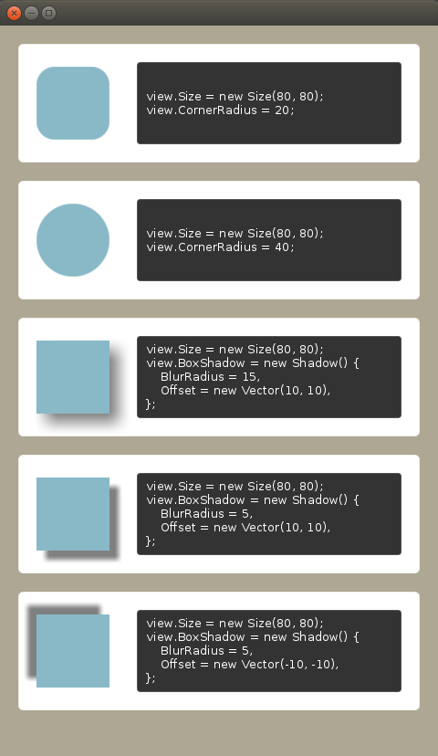

# Corner radius and shadow property

Tizen 6.0 NUI introduced new properties for `View`,
* CornerRadius
* Shadow

Here are two examples to show how to use it.
<table style="text-align:center;">
  <tr>
    <td><a href="./CornerRadiusAndShadow">1. Corner radius and shadow</a> Shows simple usage</td>
    <td><a href="./ScrollingTransition">2. Scrolling transition</a> Shows chaging corner radius</td>
  </tr>
  <tr>
    <th></th>
    <th></th>
  </tr>
</table>