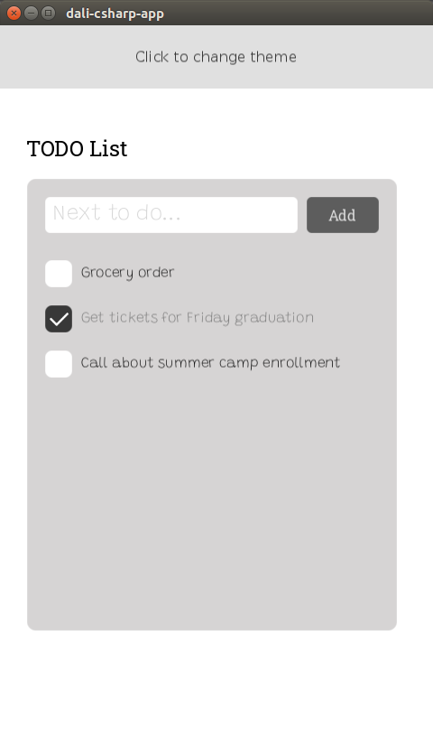
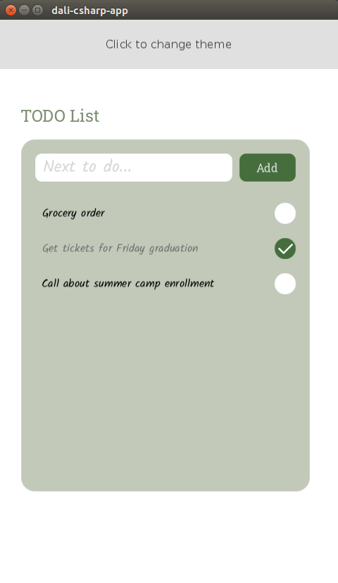

# Manage your own theme
This example shows how to create Theme instance from the xaml file and how to apply it.

## Prerequisite
The example uses external fonts to show font changing.
* [Granstander](https://fonts.google.com/specimen/Grandstander?subset=latin&query=Grandstan)
* [Kalam](https://fonts.google.com/?subset=latin&query=kalam)

## Preview
<table style="text-align:center;">
  <tr>
    <th></th>
    <th></th>
  </tr>
</table>

## Description
After run the application, please click the button at the top.
Then you see the styles applied to the application are changed overall.
The theme files can be found in the [res/Theme](./res/Theme) directory.

