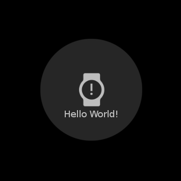

# Bottom with predefined Overlay Animation
Tizen.NUI provide several predefined styles for components.

This example shows applying an `OverlayAnimationButtonStyle` to a button.

## Notice
* This example used predefined style provided by Tizen.NUI.Component package. For more detail, see [OverlayAnimationButtonStyle](https://github.com/rabbitfor/TizenFX/blob/master/src/Tizen.NUI.Components/PreloadStyle/OverlayAnimationButtonStyle.cs). You can refer this code to make your own style.

## Sample Application
<div style="text-align:center;width:100%;"></div>

```C#
public class ComponentExample : NUIApplication
{
    public ComponentExample() : base()
    {
    }

    protected override void OnCreate()
    {
        base.OnCreate();
        
        Window window = NUIApplication.GetDefaultWindow();
        window.BackgroundColor = Color.Black;

        var button = new Button(new OverlayAnimationButtonStyle())
        {
            Text = "Hello World!",
            IconURL = Tizen.Applications.Application.Current.DirectoryInfo.Resource + "icon.png",
            IconPadding = new Extents(0, 0, 50, 0),

            Size = new Size(200, 200),
            CornerRadius = 100,

            ParentOrigin = ParentOrigin.Center,
            PivotPoint = PivotPoint.Center,
            PositionUsesPivotPoint = true
        };
        window.Add(button);
    }

    static void Main(string[] args)
    {
        ComponentExample example = new ComponentExample();
        example.Run(args);
    }
}
```