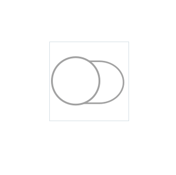

# Switch in wearable theme
This example shows how a Switch will look on a wearable device.

When an application is running on a wearable device, the wearable styles will be applied to the component by default.

The wearable Switch uses Lottie to express touch animation.

The Lottie image would look like,

<div style="text-align:center;width:100%;"></div>

* Selection  :  0 ~ 18 frames
* Unselection: 19 ~ 36 frames

## Notice
* Available only in wearable devices!
* This example used predefined style provided by Tizen.NUI.Component package. For more detail, see `GetSwitchStyle()` code in [WearableTheme](https://github.com/rabbitfor/TizenFX/blob/master/src/Tizen.NUI.Components/PreloadStyle/WearableTheme.cs). You can refer this code to make your own style.

## Sample Application


```C#
public class ComponentExample : NUIApplication
{
    public ComponentExample() : base()
    {
    }

    protected override void OnCreate()
    {
        base.OnCreate();

        // Set theme to wearable.
        // (It is not needed in the wearable device)
        Tizen.NUI.Components.StyleManager.Instance.Theme = "wearable";

        Window window = NUIApplication.GetDefaultWindow();
        window.BackgroundColor = Color.Black;

        var button = new Switch()
        {
            Size = new Size(200, 200),
            PositionUsesPivotPoint = true,
            ParentOrigin = ParentOrigin.Center,
            PivotPoint = PivotPoint.Center,
        };
        window.Add(button);
    }

    static void Main(string[] args)
    {
        ComponentExample example = new ComponentExample();
        example.Run(args);
    }
}
```