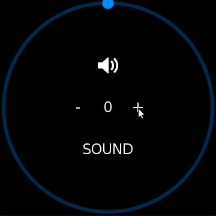

# Circular Slider

The `CircularSlider` is a class that shows the current value with the length of the line.
The thumb of slider shows the exact value at the track. In particular, `CircularSlider` class is available only in wearable devices.

This example shows how to use CircularSlider.

## Notice
* Available only in wearable devices

## Sample Application

