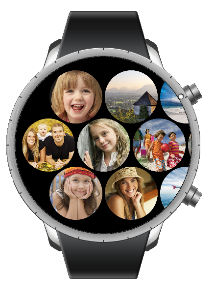

# Gallery
Gallery is a sample for gallery of wearable device.

In particular, it shows how to configure WearableGallery component.

WearableGallery is a component that display images.
You can change the layout configuration using the bezel wheel.

For more detail, please have a look at [GallerySample guide](https://code.sec.samsung.net/confluence/pages/viewpage.action?pageId=167556512).
You can see the implementation images and a example on its usage.

## Notice
* Available only in wearable devices

## Sample Application

