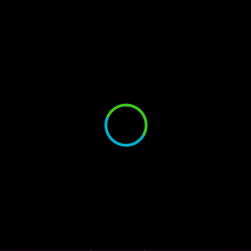

# Activity Indicator (Small)

The Activity Indicator is made of `Loading` class that is used to inform users of the ongoing operation.
It displays an unspecified amount of progress time. So, it's used when progress isn’t detectable, or if it’s not necessary to indicate how long an activity will take.

For more detail, please have a look at [Loading guide](https://developer.tizen.org/development/guides/.net-application/natural-user-interface/ui-components/loading).

This example shows how to implement Activity Indicator using `Loading` class.
Especially, this sample is for tizen wearable device only.

## Notice
* Available only in wearable devices

## Sample Application
<div style="text-align:center;width:100%;"></div>

```C#
public class ActivityIndicatorExample : NUIApplication
{
    Loading loading;

    public ActivityIndicatorExample() : base(new Size2D(360, 360), new Position2D(0, 0))
    {
    }

    protected override void OnCreate()
    {
        base.OnCreate();

        var window = NUIApplication.GetDefaultWindow();
        window.BackgroundColor = Color.Black;


        string[] imageArray = new string[90];
        for (int i = 0; i < 90; i++)
        {
            imageArray[i] = Tizen.Applications.Application.Current.DirectoryInfo.Resource + "activityindicator_small" + i.ToString("00000") + ".png";
        }

        loading = new Loading();
        loading.Size = new Size(76, 76);

        // Set the image array to Images property
        loading.Images = imageArray;

        // Positioning it to the center
        loading.ParentOrigin = ParentOrigin.Center;
        loading.PivotPoint = PivotPoint.Center;
        loading.PositionUsesPivotPoint = true;

        window.Add(loading);
    }

    static void Main(string[] args)
    {
        ActivityIndicatorExample example = new ActivityIndicatorExample();
        example.Run(args);
    }
}
```