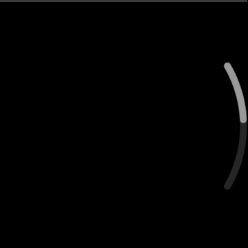

# Circular Scrollbar

CircularScrollBar is a class that provides scroll track and thumb which shapes arcs for circular devices.

Normally, it can be used in a scrollable component (e.g. ScrollableBase), but it also can be used as a standalone component.

This example shows how to use CircularScrollBar.

## Notice
* Available only in wearable devices

## Sample Application

