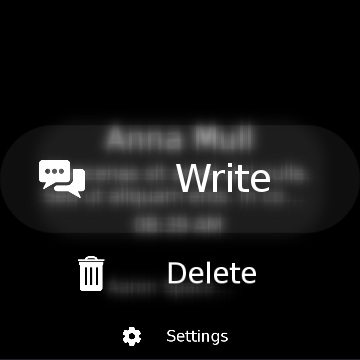

# MessageApplication

MessageApplication shows how to use WearableList and BlurView.

When opening application, there is list of dummy messages which is using WearableList.

You can pop menu list pressing three dots on right place of screen.
Message list will be blurred by BlurView and menu list is shown on that.

## Notice
* Available only in wearable devices

## ScreenShot
 