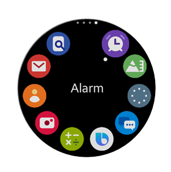
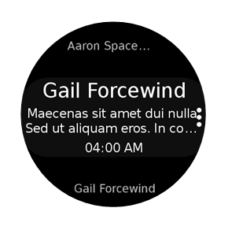

# Component Sample Applications

* Buttons
    * [Button with an overlay animation on press](./Buttons/ButtonWithOverlayAnimation/)
    * [Wearable button](./Buttons/WearableButton/)
    * [Wearable check box](./Buttons/WearableCheckBox/)
    * [Wearable radio button](./Buttons/WearableRadioButton/)
    * [Wearable switch](./Buttons/WearableSwitch/)
* Text
    * [Text label](./Text/TextLabel/)
    * [Text field](./Text/TextField/)
    * [Circular text](./Text/CircularText/)
* List
    * [Wearable list](./List/WearableList/)
    * [Circular Scrollbar - Horizontal](./List/CircularScrollbar(Horizontal)/)
    * [Circular Scrollbar - Vertical](./List/CircularScrollbar(Vertical)/)
* Indicator
    * [Circular Progress](./Indicator/CircularProgress/)
    * [Activity Indicator - Full](./Indicator/ActivityIndicator(Full)/) (Loading component with images)
    * [Activity Indicator - Small](./Indicator/ActivityIndicator(Small)/) (Loading component with images)
* Pagination
    * [Linear Pagination](./Pagination/LinearPagination/)
    * [Circular Pagination](./Pagination/CircularPagination/)
* Notification
    * [Fullsize Notification](./Notification/FullsizeNotification/)
    * [Toast Notification](./Notification/ToastNotification/)
* Popup
    * [Wearable Popup](./Popup/WearablePopup/)
* Reference Application

<table>
  <tr>
    <th></th>
    <th></th>
    <th></th>
  </tr>
  <tr style="text-align:center;">
    <td><a href="./ReferenceApplication/WApps/README.md">WApps</a></td>
    <td><a href="./ReferenceApplication/WGallery/README.md">WGallery</a></td>
    <td><a href="./ReferenceApplication/WMessage/README.md">WMessage</a></td>
  </tr>
</table>

# Coming Soon

* Slider
    * [Circular Slider](./Slider/CircularSlider)
* Reference Application
    * WHome
