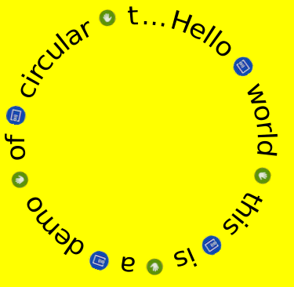

# Circular Text
This example shows how a `CircularText` will be circular text.

The `CircularText` class shows the text in circular form.

You can set various properties, such as alignment, text color, radius, angle, shadow.

Please see the following example.

## Sample Application
<div style="text-align:center;width:100%;"></div>

```C#

public class CircularTextExample : NUIApplication
{

    public CircularTextExample() : base()
    {
    }

    protected override void OnCreate()
    {
        base.OnCreate();

        Window window = NUIApplication.GetDefaultWindow();

        string resPath = Tizen.Applications.Application.Current.DirectoryInfo.Resource;
        string resImage = resPath + "application-icon-1.png";
        string image1 = "<item 'width'=26 'height'=26 'url'='" + resImage + "'/>";
        string image2 = "<item 'width'=26 'height'=26/>";

        //  the text and style parameters to be rendered into a pixel buffer.
        RendererParameters textParameters = new RendererParameters();
        textParameters.Text = "Hello " + image1 + " world " + image2 + " this " + image1 + " is " + image2 + " a " + image1 + " demo " + image2 + " of " + image1 + " circular " + image2 + " text " + image1 + " width " + image2 + " icons.";
        textParameters.HorizontalAlignment = HorizontalAlignment.Center;
        textParameters.VerticalAlignment = VerticalAlignment.Center;
        textParameters.CircularAlignment = CircularAlignment.Center;
        textParameters.FontFamily = "SamsungUI";
        textParameters.FontWeight = "";
        textParameters.FontWidth = "";
        textParameters.FontSlant = "";
        textParameters.Layout = TextLayout.Circular;
        textParameters.TextColor = Color.Black;
        textParameters.FontSize = 25;
        textParameters.TextWidth = 360u;
        textParameters.TextHeight = 360u;
        textParameters.Radius = 180u;
        textParameters.BeginAngle = 15;
        textParameters.IncrementAngle = 360;
        textParameters.EllipsisEnabled = true;
        textParameters.MarkupEnabled = true;

        // create texture and add renderer
        TextureSet textureSet = CreateTextureSet( textParameters, embeddedItems );
        Renderer renderer = CreateRenderer();
        renderer.SetTextures( textureSet );

        View actor = new View();
        actor.PivotPoint = PivotPoint.TopLeft;
        actor.ParentOrigin = ParentOrigin.TopLeft;
        actor.Position = new Position(0, 0, 0);
        actor.Size = new Size( 360, 360 );
        actor.Color = Color.White;

        actor.AddRenderer( renderer );
        window.Add(actor);
    }

    static void Main(string[] args)
    {
        CircularTextExample example = new CircularTextExample();
        example.Run(args);
    }
}

```