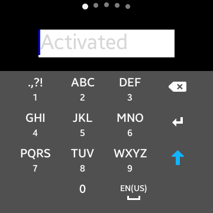

# TextField in wearable
This example shows how a `TextField` will be positioned at a wearable device.

The `TextField` class provides a control that allows single line editable text field. `Tizen.NUI.BaseComponents` namespace contains the class.

In particular, this sample shows positioning in wearable device so that TextField is not hidden by the virtual keyboard (IME).
Please see the following example.

## Sample Application
<div style="text-align:center;width:100%;"></div>

```C#
public class TextFieldExample : NUIApplication
{
    public TextFieldExample() : base()
    {
    }

    protected override void OnCreate()
    {
        base.OnCreate();

        Window window = NUIApplication.GetDefaultWindow();
        window.BackgroundColor = Color.Black;

        // Create a TextField
        TextField field = new TextField()
        {
            Size = new Size(250, 47),
            Position =  new Position(0, 50),
            BackgroundColor = Color.Black,

            // Set TextField properties, such as PlaceholderText and PrimaryCursorColor
            PointSize = 9.0f,
            PlaceholderText = "Tap to enter text",
            PlaceholderTextFocused = "Activated",
            PrimaryCursorColor = Color.Cyan,

            // Positioning it to the top center
            ParentOrigin = ParentOrigin.TopCenter,
            PivotPoint = PivotPoint.TopCenter,
            PositionUsesPivotPoint = true
        };
        window.Add(field);
    }

    [STAThread] // Forces app to use one thread to access NUI
    static void Main(string[] args)
    {
        TextFieldExample example = new TextFieldExample();
        example.Run(args);
    }
}

```